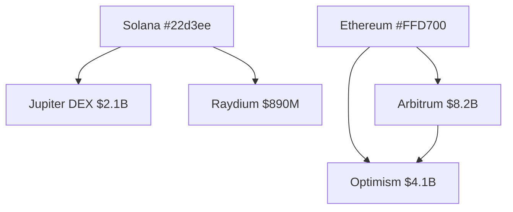
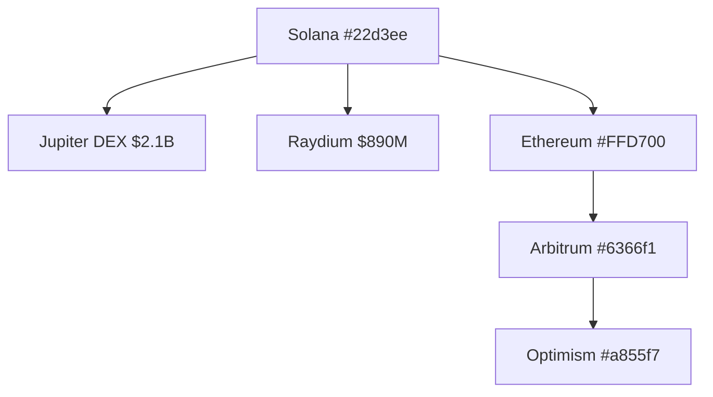

# ONYX Spatial Design

The @onyx/editor package provides 3D spatial visualization capabilities for ONYX. This skill covers how to build scenes, create nodes from natural language, and export to Mermaid diagrams.

## @onyx/editor Architecture

The editor is a server-side headless 3D spatial computing layer. It uses Three.js WebGLRenderer without React Three Fiber, keeping dependencies minimal. The SceneBuilder maintains an in-memory Map of scene nodes.

HTTP endpoints run on EDITOR_PORT (default 3009). WebSocket for collaboration runs on port 3010.

```typescript
import { createEditor } from '@onyx/editor'

const editor = await createEditor({
  port: 3009,
  wsPort: 3010,
})

// Editor ready
// HTTP: http://localhost:3009
// WS: ws://localhost:3010
```

## Key Types

Scene nodes and edges define the visualization:

```typescript
// Node in 3D space
type SceneNode = {
  id: string
  type: 'sphere' | 'box' | 'label' | 'arrow' | 'chain' | 'token' | 'agent'
  position: { x: number; y: number; z: number }
  config: Record<string, unknown>
  label?: string
  color?: string
}

// Directed edge between nodes
type SceneEdge = {
  from: string
  to: string
  label?: string
  weight?: number
}
```

Node types map to visual representations: spheres for chains/protocols, boxes for tokens, labels for text, arrows for flows.

## AgentSceneAPI Methods

The API provides fluent methods for scene manipulation:

```typescript
import { AgentSceneAPI } from '@onyx/editor'

const api = new AgentSceneAPI({ editorUrl: 'http://localhost:3009' })

// Add node from natural language
await api.addNode('Solana chain, large cyan sphere, position (0,0,0)')

// Add edge
await api.addEdge({
  from: 'solana-node',
  to: 'jupiter-node',
  label: '$2.1B TVL',
  weight: 2.1,
})

// Export as Mermaid
const mermaid = await api.toMermaid()

// Clear scene
await api.reset()
```

## AddNode from Natural Language

The addNode method parses natural language into scene nodes using Claude:

Input: `"Ethereum, large gold sphere, center of scene position (0,0,0), label 'ETH'"`
Output: `{ type: 'sphere', position: {x:0,y:0,z:0}, color: '#FFD700', label: 'Ethereum', config: { radius: 2 } }`

This allows agents to describe visualizations conversationally rather than building coordinates manually.

## HTTP Routes

The editor exposes RESTful endpoints:

```typescript
// Get health
GET /health
// { status: 'ok', nodeCount: 5 }

// Get full scene
GET /scene
// { nodes: [...], edges: [...] }

// Export Mermaid
GET /scene/mermaid
// graph TD ... (Mermaid diagram string)

// Add node
POST /scene/node
{ /* SceneNode */ }

// Add edge
POST /scene/edge
{ /* SceneEdge */ }

// Clear
POST /scene/reset
```

## toMermaid Export

Export generates a Mermaid graph for documentation:



The export includes ONYX colors as hex codes in node labels.

## Collaboration WebSocket

Multiple agents can collaborate on the same scene via WebSocket:

```typescript
// Connect to collaboration server
const ws = new WebSocket('ws://localhost:3010/editor/ws')

// Join a workspace
ws.send(JSON.stringify({
  type: 'JOIN',
  workspace: 'defi-visualization',
}))

// Add node (broadcast to all participants)
ws.send(JSON.stringify({
  type: 'ADD_NODE',
  node: solanaNode,
}))

// Receive updates
ws.onmessage = (event) => {
  const update = JSON.parse(event.data)
  // { type: 'NODE_ADDED', node: {...}, workspace: '...' }
}
```

Conflict resolution uses last-write-wins — the most recent update overwrites previous state.

## Example: Visualizing Multi-Chain Capital Flow

Creating a visualization of DeFi capital flow:

```typescript
import { AgentSceneAPI } from '@onyx/editor'

const api = new AgentSceneAPI({ editorUrl: 'http://localhost:3009' })

// Clear any existing scene
await api.reset()

// Add chain nodes (large spheres)
await api.addNode('Solana, large cyan sphere, left of center x=-5 y=0 z=0, label SOL')
await api.addNode('Ethereum, large gold sphere, center x=0 y=0 z=0, label ETH')
await api.addNode('Arbitrum, medium indigo sphere, right x=5 y=2 z=0, label ARB')
await api.addNode('Optimism, medium purple sphere, right x=5 y=-2 z=0, label OP')

// Add protocol nodes on Solana
await api.addNode('Jupiter DEX, small cyan sphere, near Solana x=-3 y=1 z=0, label JUP')
await api.addNode('Raydium, small cyan sphere, near Solana x=-3 y=-1 z=0, label RAY')

// Add TVL flow edges (weighted)
await api.addEdge({
  from: 'solana-node',
  to: 'jupiter-node',
  label: '$2.1B',
  weight: 2.1,
})
await api.addEdge({
  from: 'jupiter-node',
  to: 'solana-node',
  label: '$890M',
  weight: 0.89,
})
await api.addEdge({
  from: 'ethereum-node',
  to: 'arbitrum-node',
  label: '$8.2B',
  weight: 8.2,
})
await api.addEdge({
  from: 'arbitrum-node',
  to: 'optimism-node',
  label: '$4.1B',
  weight: 4.1,
})
await api.addEdge({
  from: 'solana-node',
  to: 'ethereum-node',
  label: '$420M bridge',
  weight: 0.42,
})

// Export for documentation
console.log(await api.toMermaid())
```

Output Mermaid:



## ONYX Palette in 3D

The editor uses ONYX's color palette for visual consistency:

| Element | Color | Hex |
|---------|-------|-----|
| Background | Indigo dark | #0d0d1f |
| Solana | Cyan | #22d3ee |
| Ethereum | Gold | #FFD700 |
| Arbitrum | Indigo | #6366f1 |
| Optimism | Purple | #a855f7 |
| Inflow edges | Success green | #4ade80 |
| Outflow edges | Error red | #f87171 |

## Environment Variables

```
EDITOR_PORT=3009
ANTHROPIC_API_KEY=sk-ant-...
```

No additional configuration required.